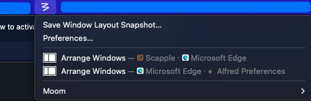

# Alfred_Moom

An Alfred Workflow to activate a saved window layout in the Moom app

Use instructions:
1. Save some snapshots with the Moom app.

   

2. Open Alfred and type "layouts". 

   

3. Select one of the options and press Enter to activate a saved window layout.

Notes:
I write this workflow for my own use.
Most of the scripts were just adjusted from the workflow alfred-things.
(https://github.com/xilopaint/alfred-things)
